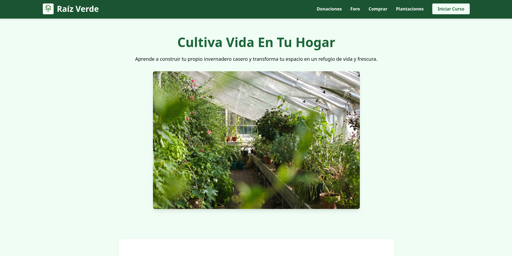

# 🌱 Raíz Verde – Cultiva Vida en Tu Hogar

Plataforma educativa que enseña a construir invernaderos caseros y cultivar alimentos de manera orgánica, sostenible y accesible. Incluye cursos prácticos, guías por cultivo, directorio de compras, foro comunitario y sistema de donaciones.

## 🚀 Demo

- Sitio principal: [raiz-verde.vercel.app](https://raiz-verde.vercel.app)
- Curso completo: `/curso`
- Cultivos específicos: `/plantaciones`
- Dónde comprar: `/comprar`
- Foro de comentarios: `/foro`
- Apoyo y donaciones: `/donaciones`

## ✨ Características principales

- **Curso interactivo** con módulos en video:
  - ¿Qué es un invernadero?
  - Tipos de invernaderos
  - Germinación y trasplante
  - Siembra directa
  - Cuidados y mantenimiento
- **Guías de cultivos específicos** (más de 10 cultivos):
  - Lechuga, espinaca, brócoli, jitomate, chile habanero, chile jalapeño, cilantro, papa, zanahoria, cebolla, ajo.
  - Cada una con métodos paso a paso, desde germinación hasta cosecha.
- **Directorio de compras**:
  - Semillas, verduras frescas, congelados, materiales para invernadero.
- **Foro comunitario** para compartir experiencias y resolver dudas.
- **Sistema de donaciones** para apoyar el mantenimiento y desarrollo gratuito de la plataforma.
- **Diseño responsivo** optimizado para dispositivos móviles y escritorio.

## 🛠️ Tecnologías utilizadas

- **Frontend:** HTML5, CSS3, JavaScript, Astro, TailwindCSS, React (básico)
- **Despliegue:** [Vercel](https://vercel.com)
- **Control de versiones:** Git + GitHub
